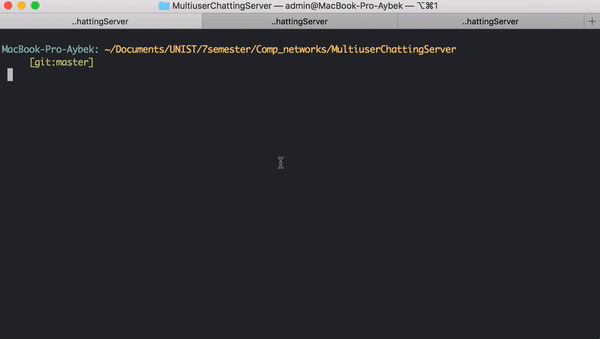

# MultiuserChattingServer

## Simple Multiuser Chat

There is a server and many clients. Clients may join any room they want and chat.

Command list:

* /list - list people in a room
* /join room_no - puts a client in a new room
* /quit - quits client

If you want to chat, you may do it in different ways:

* All : Welcome!
* Bob : Hi, Bob
* Bob, Alyce : Good morning, folks

You may schedule messages to send them after several seconds:

* Bob#60, Alyce#5 : This should come lately

Alyce will receive the message after 5 seconds, Bob will receive the message after 60 seconds.

## Build & Run

`make`

In a terminal window: `./server`

In a separate terminal window: `./client 127.0.0.1:5000 10 Bob`

In a separate terminal window: `./client 127.0.0.1:5000 10 Alyce`

In a client window, write: `All : Hello World!`

## CLI Options

`./client IP:PORT ROOM_NO NAME`

## Other

A project was developed in the class of Computer Networks taught by Professor Kyunghan Lee, [@UNIST](http://unist.ac.kr/). More info in [PDF](/Project2-Multiuser%20Chatting%20Server.pdf).

